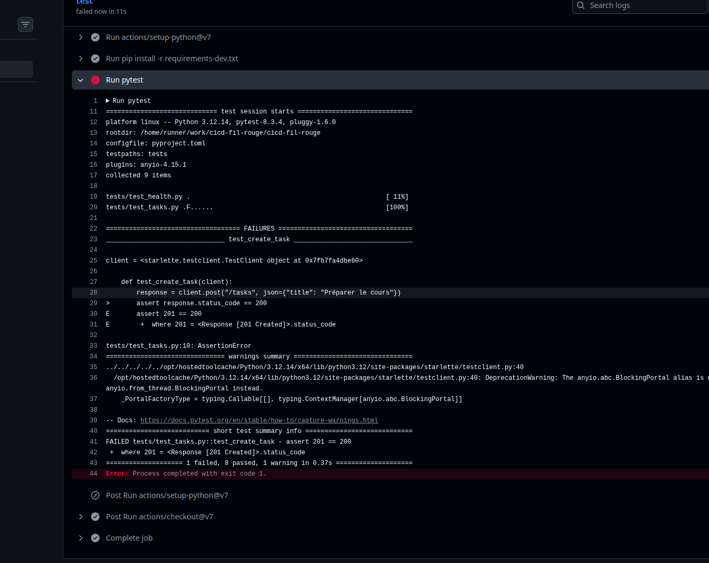

# TaskFlow — dépôt fil rouge CI/CD


TaskFlow est une petite API de gestion de tâches écrite en Python avec FastAPI.
C'est le projet fil rouge du module CI/CD (Mastère DevOps M1, Sup de Vinci) :
pendant trois jours, vous allez construire autour d'elle un pipeline complet
qui teste, construit, sécurise et livre l'application.

## Lancer l'API en local

Prérequis : Python 3.10 ou plus récent.

```bash
python3 -m venv .venv
source .venv/bin/activate          # Windows : .venv\Scripts\activate
pip install -r requirements-dev.txt
uvicorn app.main:app --reload
```

L'API répond sur http://localhost:8000 et sa documentation interactive est sur
http://localhost:8000/docs.

## Vérifier le code

```bash
pytest           # tests automatiques
ruff check .     # lint
ruff format .    # mise en forme
```

## Lancer avec Docker

```bash
docker build -t taskflow .
docker run --rm -p 8000:8000 taskflow
```

## Endpoints

| Méthode | Chemin | Rôle |
| --- | --- | --- |
| GET | `/health` | État de l'API et version |
| GET | `/tasks` | Liste des tâches |
| GET | `/tasks/search?q=...` | Recherche dans les titres |
| POST | `/tasks` | Crée une tâche (`{"title": "..."}`) |
| GET | `/tasks/{id}` | Détail d'une tâche |
| PATCH | `/tasks/{id}/done` | Marque une tâche comme faite |
| DELETE | `/tasks/{id}` | Supprime une tâche (en-tête `X-API-Token` requis) |

## Configuration

| Variable | Rôle | Défaut |
| --- | --- | --- |
| `APP_VERSION` | Version affichée par `/health` | `0.1.0` |
| `DB_PATH` | Fichier SQLite | `taskflow.db` |
| `API_TOKEN` | Jeton exigé pour supprimer une tâche | vide (suppression désactivée) |
| `NOTIFY_WEBHOOK_URL` | Webhook appelé à chaque création de tâche | vide (désactivé) |

## Équipe

- Zakaria (@zakariastrong)
- @Milhhhhane

## Gouvernance du dépôt

La branche `main` est protégée. Personne ne peut y ajouter du code sans que
l'autre membre de l'équipe l'ait vérifié.

| Règle | Pourquoi |
| --- | --- |
| Pull Request obligatoire | On ne peut pas pousser directement sur `main`. Tout passe par une PR. |
| 1 approbation | L'autre membre doit relire et valider. On ne peut pas valider sa propre PR. |
| Nouvelle validation après chaque commit | Si le code change après la relecture, il faut le relire encore. |
| Code Owners | Les fichiers du pipeline (`.github/workflows/`) doivent être validés par un responsable. Changer le pipeline, c'est changer les contrôles. |
| Pas de force push | Personne ne peut effacer ou modifier l'historique de `main`. |
| Pas de suppression | Personne ne peut supprimer `main`. |
| Pas d'exception | Les règles sont les mêmes pour tout le monde, même pour l'admin. |

La CI sera ajoutée plus tard comme contrôle obligatoire.

### Preuve : le push direct est refusé

Quand on essaie de pousser directement sur `main`, GitHub refuse :


### Bonus : commits signés

Le nom de l'auteur d'un commit peut être faux : n'importe qui peut écrire
le nom de quelqu'un d'autre. Nous signons nos commits avec une clé SSH pour
prouver qui les a écrits. GitHub affiche alors « Verified ».


Nous n'avons pas rendu la signature obligatoire, car chaque membre devrait
d'abord configurer sa clé. Sinon, ses commits seraient refusés.

## Pipeline CI

Le pipeline est dans `.github/workflows/ci.yaml`. Il se lance à chaque Pull Request
vers `main`. Chaque job tourne sur une machine neuve.

| Job | Ce qu'il vérifie |
| --- | --- |
| `lint` | La forme du code avec ruff : `ruff check .` cherche les erreurs (import inutile, variable jamais utilisée…) et `ruff format --check .` vérifie la mise en forme. |
| `test` | Le bon fonctionnement du code avec `pytest`. Ce job tourne 3 fois en même temps, sur Python 3.11, 3.12 et 3.13 (matrice). |
| `CI OK` | Attend la fin de tous les autres jobs et vérifie qu'ils ont tous réussi. |

Seul le check `CI OK` est obligatoire dans le ruleset de `main`.
S'il est rouge, la Pull Request ne peut pas être mergée.

### Accélérer le pipeline

- **Cache pip** : les paquets téléchargés sont gardés d'un run à l'autre.
- **Matrice** : les tests sur les 3 versions de Python tournent en parallèle.
- **Concurrency** : si on pousse un nouveau commit, le run en cours sur la même branche est annulé.
- **Artefact** : le rapport des tests (`rapport-tests-<version>`) est sauvegardé et téléchargeable depuis la page du run.

Durée de l'étape `pip install` (job `test`, Python 3.12) :

| | Durée |
| --- | --- |
| Sans cache | 6 s |
| Avec cache | 3 s |

Avec le cache, pip ne télécharge plus les paquets : il les récupère dans le cache
et n'a plus qu'à les installer. Le gain est petit ici car le projet a peu de dépendances.

### Le rôle de CI OK

CI OK résume tous les autres jobs en un seul check : c'est le seul que le ruleset
demande. Ainsi, on peut changer la matrice sans modifier le ruleset, alors qu'avant,
ajouter la matrice avait bloqué toutes les PR, car le check `test` attendu n'existait plus.

CI OK utilise `if: always()` pour tourner même si un autre job échoue : sans ça,
il serait « skipped », et GitHub compte un check skipped comme réussi,
donc une PR avec des tests rouges pourrait être mergée.

### Preuve : PR bloquée par un test cassé

Nous avons cassé un test exprès (`test_create_task` attend `200` au lieu de `201`).
Le job `test` échoue :



Et GitHub bloque le merge de la PR :


