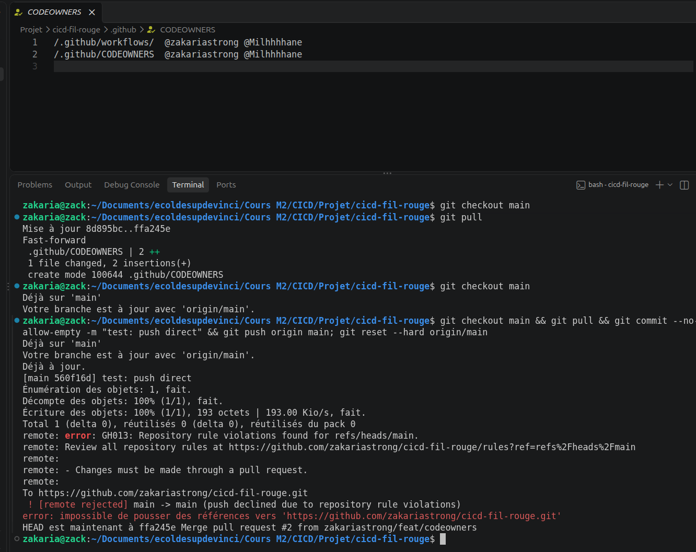
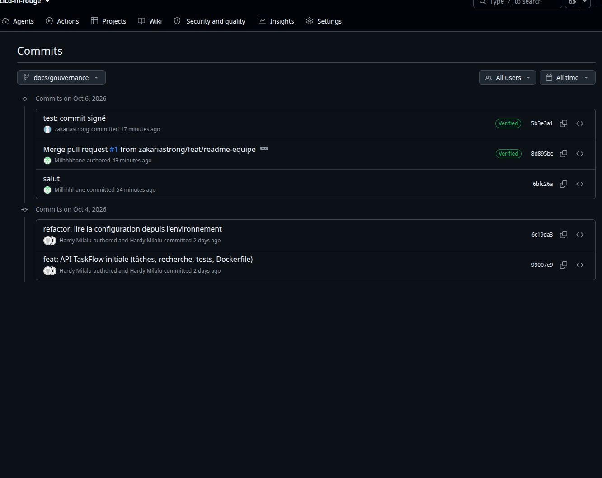

# TaskFlow — dépôt fil rouge CI/CD

TaskFlow est une petite API de gestion de tâches écrite en Python avec FastAPI.
C'est le projet fil rouge du module CI/CD (Mastère DevOps M1, Sup de Vinci) :
pendant trois jours, vous allez construire autour d'elle un pipeline complet
qui teste, construit, sécurise et livre l'application.

## Lancer l'API en local

Prérequis : Python 3.10 ou plus récent.

```bash
python3 -m venv .venv
source .venv/bin/activate          # Windows : .venv\Scripts\activate
pip install -r requirements-dev.txt
uvicorn app.main:app --reload
```

L'API répond sur http://localhost:8000 et sa documentation interactive est sur
http://localhost:8000/docs.

## Vérifier le code

```bash
pytest           # tests automatiques
ruff check .     # lint
ruff format .    # mise en forme
```

## Lancer avec Docker

```bash
docker build -t taskflow .
docker run --rm -p 8000:8000 taskflow
```

## Endpoints

| Méthode | Chemin | Rôle |
| --- | --- | --- |
| GET | `/health` | État de l'API et version |
| GET | `/tasks` | Liste des tâches |
| GET | `/tasks/search?q=...` | Recherche dans les titres |
| POST | `/tasks` | Crée une tâche (`{"title": "..."}`) |
| GET | `/tasks/{id}` | Détail d'une tâche |
| PATCH | `/tasks/{id}/done` | Marque une tâche comme faite |
| DELETE | `/tasks/{id}` | Supprime une tâche (en-tête `X-API-Token` requis) |

## Configuration

| Variable | Rôle | Défaut |
| --- | --- | --- |
| `APP_VERSION` | Version affichée par `/health` | `0.1.0` |
| `DB_PATH` | Fichier SQLite | `taskflow.db` |
| `API_TOKEN` | Jeton exigé pour supprimer une tâche | vide (suppression désactivée) |
| `NOTIFY_WEBHOOK_URL` | Webhook appelé à chaque création de tâche | vide (désactivé) |

## Équipe

- Zakaria (@zakariastrong)
- @Milhhhhane

## Gouvernance du dépôt

La branche `main` est protégée. Personne ne peut y ajouter du code sans que
l'autre membre de l'équipe l'ait vérifié.

| Règle | Pourquoi |
| --- | --- |
| Pull Request obligatoire | On ne peut pas pousser directement sur `main`. Tout passe par une PR. |
| 1 approbation | L'autre membre doit relire et valider. On ne peut pas valider sa propre PR. |
| Nouvelle validation après chaque commit | Si le code change après la relecture, il faut le relire encore. |
| Code Owners | Les fichiers du pipeline (`.github/workflows/`) doivent être validés par un responsable. Changer le pipeline, c'est changer les contrôles. |
| Pas de force push | Personne ne peut effacer ou modifier l'historique de `main`. |
| Pas de suppression | Personne ne peut supprimer `main`. |
| Pas d'exception | Les règles sont les mêmes pour tout le monde, même pour l'admin. |

La CI sera ajoutée plus tard comme contrôle obligatoire.

### Preuve : le push direct est refusé

Quand on essaie de pousser directement sur `main`, GitHub refuse :



### Bonus : commits signés

Le nom de l'auteur d'un commit peut être faux : n'importe qui peut écrire
le nom de quelqu'un d'autre. Nous signons nos commits avec une clé SSH pour
prouver qui les a écrits. GitHub affiche alors « Verified ».



Nous n'avons pas rendu la signature obligatoire, car chaque membre devrait
d'abord configurer sa clé. Sinon, ses commits seraient refusés.
